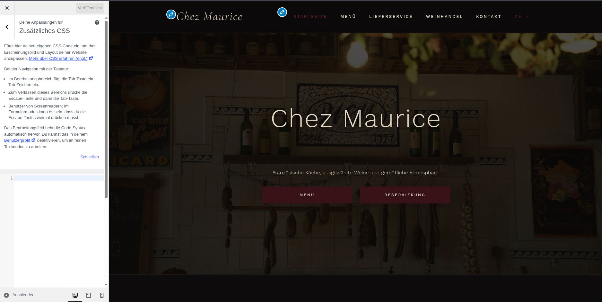
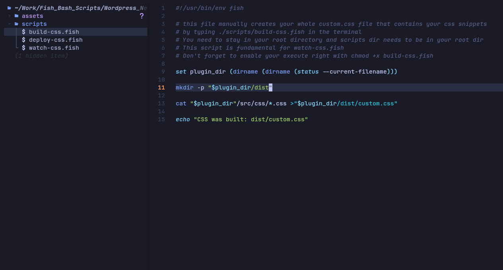
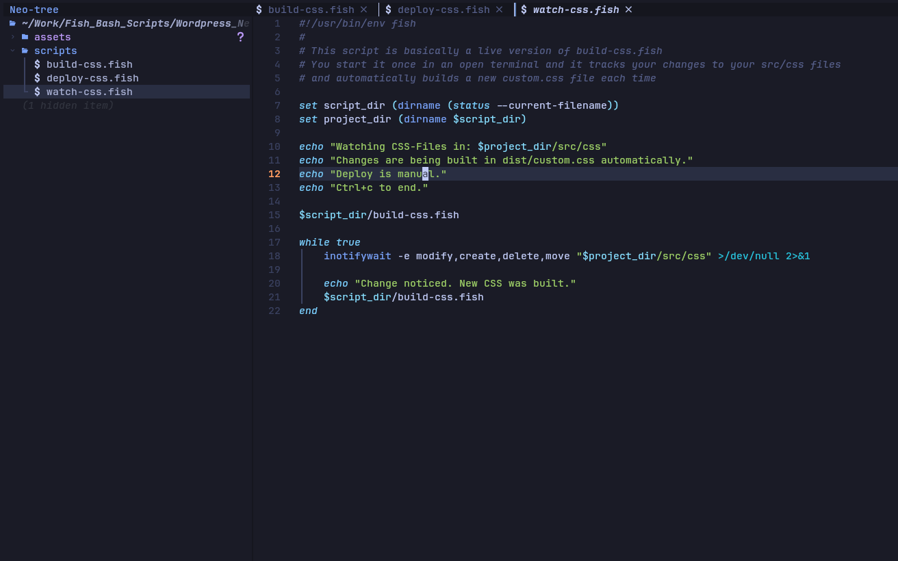
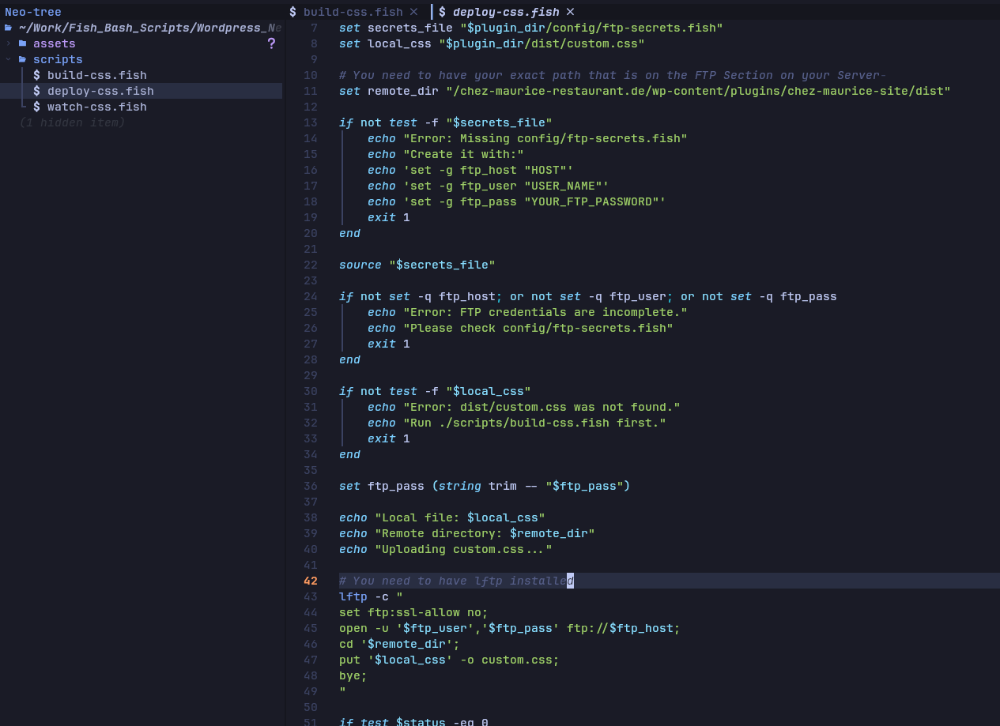

# WordPress Neovim CSS Workflow

## The Reason I got this idea



I just thought it is a pain to work with that small window on the left of the WP Editor
especially when you are getting to the point of scrolling up and down constantly

## The Solution







This project provides a small script-based workflow for editing custom WordPress CSS efficiently from Neovim.

Instead of editing CSS directly inside the WordPress editor, the CSS is written locally in a clean project structure, combined into one build file, watched automatically during development, and deployed manually when needed.

## Goal

The goal of this workflow is to make WordPress styling more structured, faster, and easier to maintain.

It allows you to:

* write CSS locally in Neovim
* split CSS into multiple organized files
* automatically build one final `custom.css`
* keep the WordPress plugin/theme CSS clean
* deploy changes manually when they are ready

## Project Structure

```txt
project-root/
├── scripts/
│   ├── build-css.fish
│   ├── watch-css.fish
│   └── deploy-css.fish
├── src/
│   └── css/
│       ├── header.css
│       ├── footer.css
│       ├── buttons.css
│       └── responsive.css
├── dist/
│   └── custom.css
└── README.md
```

## Scripts

### `build-css.fish`

This script combines all CSS files from:

```txt
src/css/
```

into one final file:

```txt
dist/custom.css
```

It is useful when you want to manually rebuild your CSS after making changes.

Run it with:

```bash
./scripts/build-css.fish
```

### `watch-css.fish`

This script watches the `src/css/` directory for changes.

Whenever a CSS file is modified, created, deleted, or moved, it automatically runs `build-css.fish` again.

Run it with:

```bash
./scripts/watch-css.fish
```

Stop it with:

```bash
Ctrl + C
```

This is useful while actively working in Neovim because every saved CSS change automatically updates `dist/custom.css`.

### `deploy-css.fish`

This script is used to manually deploy the built CSS file to the WordPress environment.

The idea is:

```txt
dist/custom.css
```

gets copied or uploaded to the correct WordPress plugin/theme location.

Run it with:

```bash
./scripts/deploy-css.fish
```

The deploy step is manual on purpose, so changes are only pushed to WordPress when they are ready.

## Requirements

You need:

* fish shell
* Neovim or another code editor
* `inotify-tools` for automatic watching
* access to the WordPress plugin/theme directory

On Arch / Omarchy Linux:

```bash
sudo pacman -S inotify-tools
```

## Make Scripts Executable

Before running the scripts, make them executable:

```bash
chmod +x scripts/*.fish
```

After that, you can run them directly:

```bash
./scripts/build-css.fish
./scripts/watch-css.fish
./scripts/deploy-css.fish
```

## Typical Workflow

### 1. Open the project in Neovim

```bash
nvim .
```

### 2. Edit CSS files inside `src/css/`

Example:

```txt
src/css/header.css
src/css/buttons.css
src/css/responsive.css
```

### 3. Start the watcher

```bash
./scripts/watch-css.fish
```

Now every CSS change is automatically rebuilt into:

```txt
dist/custom.css
```

### 4. Deploy when ready

```bash
./scripts/deploy-css.fish
```

This sends the final CSS file to the WordPress project.

## Example Development Flow

```bash
./scripts/watch-css.fish
```

Then edit a file:

```txt
src/css/header.css
```

After saving, the watcher automatically rebuilds:

```txt
dist/custom.css
```

When the result is ready:

```bash
./scripts/deploy-css.fish
```

## Notes

The `dist/custom.css` file is generated automatically.

Usually, you should edit files inside:

```txt
src/css/
```

and not directly inside:

```txt
dist/custom.css
```

because the `dist/custom.css` file will be overwritten every time `build-css.fish` runs.
